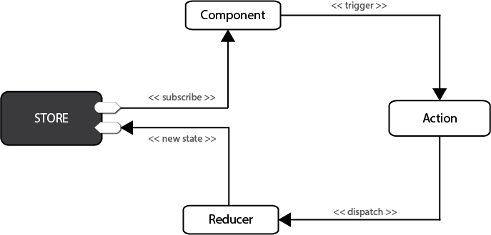

# redux

```
cnpm install redux --save
```
## 目录
[**一、redux基本用法**](#一、redux基本用法)<br>
[**二、react项目中使用redux**](#二、react项目中使用redux)<br>
[**三、redux处理异步**](#三、redux处理异步)<br>
[**四、redux调试工具：reduxDevTools**](#四、redux调试工具：reduxDevTools)<br>
[**五、使用react-redux**](#五、使用react-redux)<br>
[**6-loading基础组件**](#6-loading基础组件)

## <a id="1-jsonp抓取数据"></a>1-jsonp抓取数据


### <a id="一、redux基本用法"></a>一、redux基本用法

- 首先通过reducer新建store，随时通过store.getState获取状态
- 需要状态变更,store.dispatch（action）来修改状态
- Reducer函数接受state和action，返回新的state ，可以用store.subscribe监听每次修改



在新建的react项目中，src/index.js改成
```javascript
import { createStore } from 'redux';

// 新建store
// 这就是reducer处理函数，参数是state和新的action
// 根据老的state和新的action生成新的state
function counter(state=0, action) {
  switch(action.type){
    case '加机关枪':
      return state + 1
    case '减机关枪':
      return state - 1
    default:
      return 10
  }
}
const store = createStore(counter)

const init = store.getState();
console.log(`一开始有机枪${init}把`)

function listener() {
  const current = store.getState()
  console.log(`现在有机枪${current}把`)
}
// store.subscribe监听每次修改
store.subscribe(listener)

// 派发事件 传递action，提交状态变更的申请
store.dispatch({type: '加机关枪'})
store.dispatch({type: '加机关枪'})
store.dispatch({type: '减机关枪'})
// console.log(store.getState())
```
启动项目：npm start ，访问localhost:3000看开发者console


### <a id="二、react项目中使用redux"></a>二、react项目中使用redux

- 把store.dispatch方法传递给组件，内部可以调用修改状态
- Subscribe订阅render函数，每次修改都重新渲染
- Redux相关内容，移到单独的文件index.redux.js 单独管理

src/index.redux.js（新建）
```javascript
// redux相关内容

const ADD_GUN = '加机关枪';
const REMOVE_GUN = '减机关枪';

// 这就是reducer处理函数，参数是state和新的action
export function counter(state=0, action) {
  switch(action.type){
    case ADD_GUN:
      return state + 1
    case REMOVE_GUN:
      return state - 1
    default:
      return 10
  }
}

// action creator
export function addGun() {
  return {type: ADD_GUN}
}
export function removeGun() {
  return {type: REMOVE_GUN}
}
```
src/index.js
```javascript
import React from 'react';
import ReactDOM from 'react-dom';
import { createStore } from 'redux';

import App from './App';
import { counter, addGun, removeGun } from './index.redux'

// 新建store
const store = createStore(counter)

// 将store等传递给App组件
function render() {
  ReactDOM.render(<App store={store} addGun={addGun} removeGun={removeGun}/>, document.getElementById('root'));
}

render()
// 监听，状态改变后，执行render
store.subscribe(render)
```

src/App.js
```javascript
import React, { Component } from 'react';

class App extends Component {
  render() {
    // 接收传递过来的数据
    const store = this.props.store;
    const num = store.getState();
    const addGun = this.props.addGun;
    const removeGun = this.props.removeGun;
    return (
      <div>
        <h1>现在有机枪{num}把</h1>
        {/* store.dispatch派发事件 */}
        <button onClick={() => store.dispatch(addGun())}>申请武器</button>
        <button onClick={() => store.dispatch(removeGun())}>上交武器</button>
      </div>
    );
  }
}

export default App;
```


### <a id="三、redux处理异步"></a>三、redux处理异步

Redux默认只处理同步，异步任务需要react-thunk中间件
- npm install redux-thunk --save
- 使用applyMiddleware开启thunk中间件
- Action可以返回函数，使用dispatch提交action

src/index.js <br>


src/index.redux.js <br>


src/App.js <br>


### <a id="四、redux调试工具：reduxDevTools"></a>四、redux调试工具：reduxDevTools

Chrome搜索redux 安装
- 新建store的时候判断window.devToolsExtension
- 使用compose结合thunk和window.devToolsExtension
- 调试窗的redux选项卡，实时看到state

src/index.js


### <a id="五、使用react-redux"></a>五、使用react-redux

1.说明：
- npm install react-redux --save
- 忘记subscribe，记住reducer，action和dispatch即可
- React-redux提供Provider和connect两个接口来链接

2.React-redux具体使用：

- Provider组件在应用最外层，传入store即可，只用一次
- Connect负责从外部获取组件需要的参数
- Connect可以用装饰器的方式来写

src/index.js


src/App.js


3.Connect可以用装饰器的方式来写:

- npm run eject弹出个性化配置
- npm install babel-plugin-transform-decorators-legacy插件
- package.json里babel加上plugins配置


报错：Error: The ‘decorators’ plugin requires a ‘decoratorsBeforeExport’ option, whose value must be a boolean. If you are migrating from Babylon/Babel 6 or want to use the old decorators proposal, you should use the ‘decorators-legacy’ plugin instead of ‘decorators’.

解决：
```
cnpm install @babel/plugin-proposal-decorators --save-dev

babel配置修改
"plugins": [
  ["@babel/plugin-proposal-decorators", { "legacy": true }]
]
```