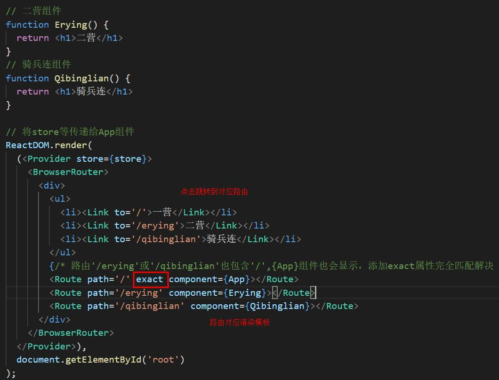
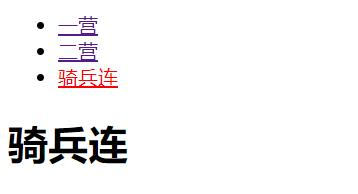
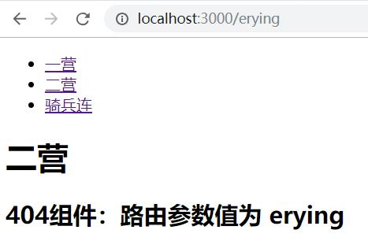
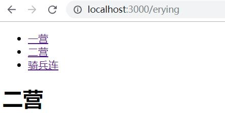
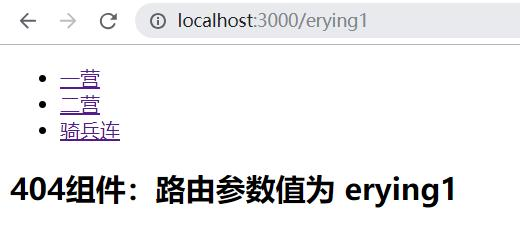
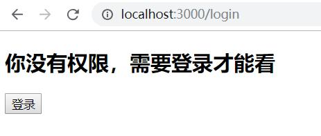
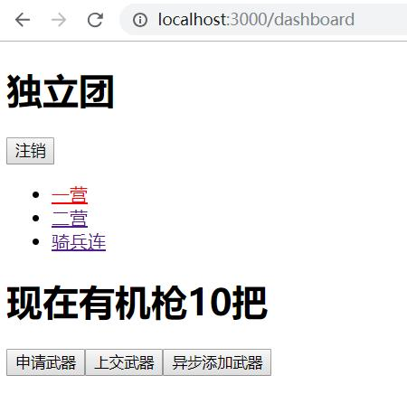

# react router

将02_redux项目为基础添加router：[02_redux](https://github.com/ccyinghua/React/tree/master/02_redux)

- [**一、初识router4**](#一、初识router4)
- [**二、与redux配合**](#二、与redux配合)
  - [2.1登录与注销](#2.1登录与注销)


### <a id="一、初识router4"></a>一、初识router4

1、router4使用react-router-dom作为浏览器端的路由。
```
cnpm install react-router-dom --save
```
- BrowserRouter,包裹整个应用
- Router 路由对应渲染的组件，可嵌套
- Link 跳转专用

src/index.js
```javascript
import { BrowserRouter, Route, Link } from 'react-router-dom';
```




2、其他组件：
- url参数，Route组件参数可用冒号表示参数
- Redirect组件跳转
- Switch只渲染一个子Route组件，可用于路由错误时渲染404组件等

```javascript
import { 
  BrowserRouter, 
  Route, 
  Link,
  Redirect,
  Switch
} from 'react-router-dom';

// 测试组件
class Test extends React.Component {
  constructor(props) {
    super(props)
  }
  render() {
    console.log(this.props)
    return <h2>404组件：路由参数值为 {this.props.match.params.location}</h2>
  }
}

{/* 页面刷新都跳转这个路由了 */}
<Redirect to='/aa'></Redirect>

{/* Switch只渲染命中的第一个模板组件：无Switch时'/erying'等路由也会匹配'/:location'从而渲染Test组件 */}
<Switch>
  {/* 路由'/erying'或'/qibinglian'也包含'/',{App}组件也会显示，添加exact属性完全匹配解决 */}
  <Route path='/' exact component={App}></Route>
  <Route path='/erying' component={Erying}></Route>
  <Route path='/qibinglian' component={Qibinglian}></Route>
  <Route path='/:location' component={Test}></Route>
</Switch>
```
无Switch时：<br>


有Switch时：<br>


有Switch，路由错误时：<br>



### <a id="二、与redux配合"></a>二、与redux配合

- 复杂redux应用，多个reducer,用combineReducers合并

reducer.js
```javascript
// 合并所有reducer 并且返回
import { combineReducers } from 'redux';
import { counter } from './index.redux'
import { auth } from './Auth.redux'

export default combineReducers({counter, auth})
```
src/index.js
```javascript
// import { counter } from './index.redux'
import reducers from './reducer'

// 新建store
const store = createStore(reducers, compose(
  applyMiddleware(thunk),
  window.devToolsExtension ? window.devToolsExtension() : f => f
))

// console.log(store.getState()); 
// {
//   auth: {isAuth: false, user: '李云龙},
//   counter: 10
// }
```
使用：
```javascript
import React from 'react';
import { Route, Link, Redirect } from 'react-router-dom';
import { connect } from 'react-redux';
import App from './App';
import { logout } from './Auth.redux';

// 两个reducers每个reducers都有一个state:index.redux.js与Auth.redux.js
// 合并reducers:reducer.js
// 装饰器模式
@connect(
  // 你要state什么属性放到props里
  state => (state.auth),
  // 你要什么方法，放到props里，自动dispatch
  { logout }
)

class Dashboard extends React.Component {
  constructor(props) {
    super(props)
  }
  render() {
    console.log(this.props)
    const redirectToLogin = <Redirect to='/login'></Redirect>;
    const app = (
      <button onClick={this.props.login}>登录</button>
    )
    return this.props.isAuth ? app : redirectToLogin;
  }
}

export default Dashboard;
```

### <a id="2.1登录与注销"></a>2.1登录与注销

页面结果：<br>

<br>

新建文件：
- Dashboard.js页面(登录后跳转的页面)
- Auth.js登录页
- Auth.redux.js登录数据管理
- reducer.js 合并多个reducer数据

[Auth.redux.js](https://github.com/ccyinghua/React/blob/master/03_react%20router/src/Auth.redux.js)

[reducer.js合并reducer](https://github.com/ccyinghua/React/blob/master/03_react%20router/src/reducer.js)
```javascript
// 合并所有reducer 并且返回
import { combineReducers } from 'redux';
import { counter } from './index.redux'
import { auth } from './Auth.redux'

export default combineReducers({counter, auth})
```
[src/index.js入口文件](https://github.com/ccyinghua/React/blob/master/03_react%20router/src/index.js)
```javascript
import React from 'react';
import ReactDOM from 'react-dom';
import { createStore, applyMiddleware, compose } from 'redux';
import thunk from 'redux-thunk';
import { Provider } from 'react-redux';
import { 
  BrowserRouter, 
  Route,
  Redirect,
  Switch
} from 'react-router-dom';
import Auth from './Auth';
import Dashboard from './Dashboard';
import reducers from './reducer'

// 新建store
const store = createStore(reducers, compose(
  applyMiddleware(thunk),
  window.devToolsExtension ? window.devToolsExtension() : f => f
))

// console.log(store.getState()); 
// {
//   auth: {isAuth: false, user: '李云龙},
//   counter: 10
// }

// 将store等传递给App组件
ReactDOM.render(
  (<Provider store={store}>
    <BrowserRouter>
      {/* Switch只渲染命中的第一个模板组件 */}
      <Switch>
        <Route path='/login' component={Auth}></Route>
        <Route path='/dashboard' component={Dashboard}></Route>
        {/* 刷新都跳转这个路由了 */}
        <Redirect to='/dashboard'></Redirect>
      </Switch>
    </BrowserRouter>
  </Provider>),
  document.getElementById('root')
);
```
[Auth.js登录页](https://github.com/ccyinghua/React/blob/master/03_react%20router/src/Auth.js)
```javascript
import React from 'react';
import { Redirect } from 'react-router-dom';
import { connect } from 'react-redux';
import { login } from './Auth.redux';

// 两个reducers每个reducers都有一个state:index.redux.js与Auth.redux.js
// 合并reducers:reducer.js
// 装饰器模式
@connect(
  // 你要state什么属性放到props里
  state => state.auth,
  // 你要什么方法，放到props里，自动dispatch
  { login }
)

class Auth extends React.Component {
  render() {
    return (
      <div>
        { this.props.isAuth ? <Redirect to='/dashboard'></Redirect> : null }
        <h2>你没有权限，需要登录才能看</h2>
        <button onClick={this.props.login}>登录</button>
      </div>
    )
  }
}

export default Auth;
```
[Dashboard.js页面(登录后跳转的页面)](https://github.com/ccyinghua/React/blob/master/03_react%20router/src/Dashboard.js)
```javascript
import React from 'react';
import { Route, Link, Redirect } from 'react-router-dom';
import { connect } from 'react-redux';
import App from './App';
import { logout } from './Auth.redux';

// 二营组件
function Erying() {
  return <h1>二营</h1>
}
// 骑兵连组件
function Qibinglian() {
  return <h1>骑兵连</h1>
}

// 两个reducers每个reducers都有一个state:index.redux.js与Auth.redux.js
// 合并reducers:reducer.js
// 装饰器模式
@connect(
  // 你要state什么属性放到props里
  state => (state.auth),
  // 你要什么方法，放到props里，自动dispatch
  { logout }
)

class Dashboard extends React.Component {
  render() {
    console.log(this.props)
    const match = this.props.match;  // match.url = '/dashboard'
    const redirectToLogin = <Redirect to='/login'></Redirect>;
    const app = (
      <div>
        <h1>独立团</h1>
        {this.props.isAuth ? <button onClick={this.props.logout}>注销</button> : null}
        <ul>
          <li><Link to={`${match.url}`}>一营</Link></li>
          <li><Link to={`${match.url}/erying`}>二营</Link></li>
          <li><Link to={`${match.url}/qibinglian`}>骑兵连</Link></li>
        </ul>
        <Route path={`${match.url}`} exact component={App}></Route>
        <Route path={`${match.url}/erying`} component={Erying}></Route>
        <Route path={`${match.url}/qibinglian`} component={Qibinglian}></Route>
        {/* <Route path='/:location' component={Test}></Route> */}
      </div>
    )
    return this.props.isAuth ? app : redirectToLogin;
  }
}

export default Dashboard;
```


