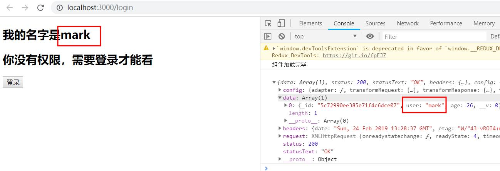
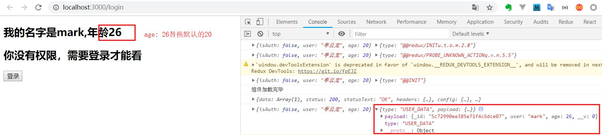
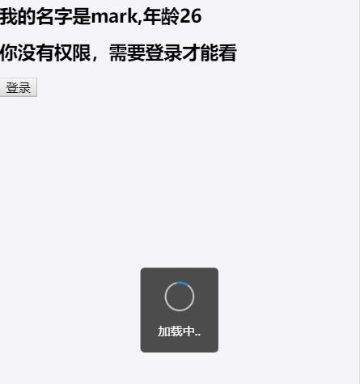

# axios

- [**一、axios请求**](#一、axios请求)
- [**二、axios拦截器**](#二、axios拦截器)

### <a id="一、axios请求"></a>一、axios请求

1、安装axios:
```
cnpm install axios --save
```
2、package.json文件添加代理：express后端是9093端口，项目是3000
```
"proxy": "http://localhost:9093"
```
3、使用axios:

- 不使用redux时，显示axios获取的数据：
src/Auth.js
```javascript
import axios from 'axios';

class Auth extends React.Component {
  constructor(props) {
    super(props)
    this.state = {
      data: {}
    }
  }
  componentDidMount() {
    console.log('组件加载完毕');
    axios.get('/data').then(res => {
      console.log(res);
      if (res.status === 200) {
        this.setState({data: res.data[0]})
      }
    })
  }
  render() {
    return (
      <div>
        <h2>我的名字是{this.state.data.user}</h2>
      </div>
    )
  }
}

export default Auth;
```


- 使用redux时，显示axios获取的数据：
src/Auth.redux.js
```javascript
import axios from 'axios';
const USER_DATA = 'USER_DATA';

const initState = {
  isAuth: false, 
  user: '李云龙',
  age: 20
}

export function auth(state = initState, action) {
  console.log(state,action)
  switch(action.type) {
    case LOGIN:
      return {...state, isAuth: true};
    case LOGOUT:
      return {...state, isAuth: false};
    case USER_DATA:
      // return {...state, ...action.payload};
      return {...state, user: action.payload.user, age: action.payload.age};
    default:
      return state;
  }
}

// action
export function getUserData() {
  // dispatch用来通知数据修改
  return dispatch => {
    axios.get('/data').then(res => {
      console.log(res);
      if (res.status === 200) {
        dispatch(userData(res.data[0]))
      }
    })
  }
}
export function userData(data) {
  // data: {_id: "5c72990ee385e71f4c6dce07", user: "mark", age: 26}
  return {type: USER_DATA, payload: data}
}
```
src/Auth.js
```javascript
import { login, getUserData } from './Auth.redux';

@connect(
  // 你要state什么属性放到props里
  state => state.auth,
  // 你要什么方法，放到props里，自动dispatch
  { login, getUserData }
)

class Auth extends React.Component {
  componentDidMount() {
    console.log('组件加载完毕');
    this.props.getUserData()
  }
  render() {
    return (
      <div>
        <h2>我的名字是{this.props.user},年龄{this.props.age}</h2>
      </div>
    )
  }
}

export default Auth;
```


### <a id="二、axios拦截器"></a>二、axios拦截器

Axios.interceptors设置拦截器，比如全局的loading,loading 效果使用UI框架antd-mobile

安装最新版antd-mobile,更多操作参考[antd-mobile官网](https://mobile.ant.design/docs/react/introduce-cn)
```javascript
cnpm install antd-mobile@next --save-dev
// 按需加载
cnpm install babel-plugin-import --save-dev
```
按需加载package.json配置
```javascript
// .babelrc or babel-loader option
{
  "plugins": [
    ["import", { libraryName: "antd-mobile", style: "css" }] // `style: true` 会加载 less 文件
  ]
}
```
src/index.js
```javascript
import './config.js'
```
新建src/config.js
```javascript
import axios from 'axios';
import { Toast } from 'antd-mobile';

// 拦截请求
axios.interceptors.request.use(function(config) {
  Toast.loading("加载中..", 0)
  return config
})

// 拦截响应
axios.interceptors.response.use(function(config) {
  setTimeout(() => {
    Toast.hide()
  }, 2000)
  return config
})
```


